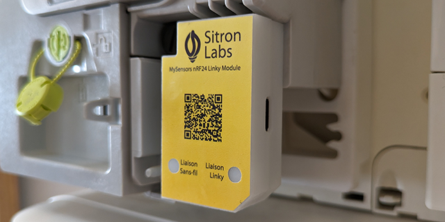

# MySensors nRF24 Linky Module
IoT energy sensor for Linky electricity meters in France

### Get one

### What is MySensors?
Always wanted to make your own IoT sensors to automate your home? [MySensors](https://www.mysensors.org/) does all the heavy lifting so you can focus on what matters. It integrates into a lot of [controllers](https://www.mysensors.org/controller) (Home Assistant, Jeedom, Domoticz, and more) so you can easily connect custom made devices into your existing home automation setup.

### Product description
This module plugs into french Linky electricity meters to read real-time information provided through the official consumer-side Télé-Information Client (TIC) output. That information, refreshed approximately every 10 seconds includes:
- Power (in W)
- Current (in A) for each phase
- Accumulated consumption (in Wh)
- Advance notice for EJP Rate (Préavis)
- Pricing for EJP Rate (Heures Normales, Heures Pointe Mobile)
- Pricing for HC Rate (Heures Pleines, Heures Creuses)
- Pricing for Tempo rate (Bleu, Blanc ou Rouge)
- Tomorrow's color for Tempo Rate (Bleu, Blanc ou Rouge)

### Features
- Designed for [MySensors](https://www.mysensors.org/) with a nRF24 radio
- Self powered, doesn't require a battery
- Opensource firmware
- Follows [Enedis-NOI-CPT_54E](https://www.enedis.fr/media/2035/download) specification
- Auto detects baud rate and mode (1200 bps for historic, 9600 bps for standard)

### Known limitations
Because I don't have access to a meter in standard mode, the firmware currently supports historic mode. If you are interested, you are welcome to submit a pull request or open a ticket.

### Upgrade the firmware
This firmware requires PlatfomIO. It works as an add-on to Visual Studio Code editor. To install it, follow the instructions [here](https://platformio.org/install/ide?install=vscode).

Retrieve a copy of the firmware code. If git is something you are familiar with or you would like to contribute, that's the recommanded way. Otherwise, simply download and extract the [zip archive](https://github.com/sitronlabs/MySensors-nRF24-Linky-Modue/archive/refs/heads/master.zip) of the latest code.

Open Visual Sutdio Code, select "File / Open Folder" and navigate to the copy of the firmware code you have just downloaded.

In the left bar click on the PlatformIO icon, then on "Project Tasks / General / Build". The first compilation might take some time as PlatformIO will download all the neccessary libraries, compilers and tools.

Once it compiles sucessfully, you are ready to upload that firmware to your Linky module. Connect your Linky module to your computer using a USB cable. Still in the left bar click on "Project Tasks / General / Upload".

That's it.
